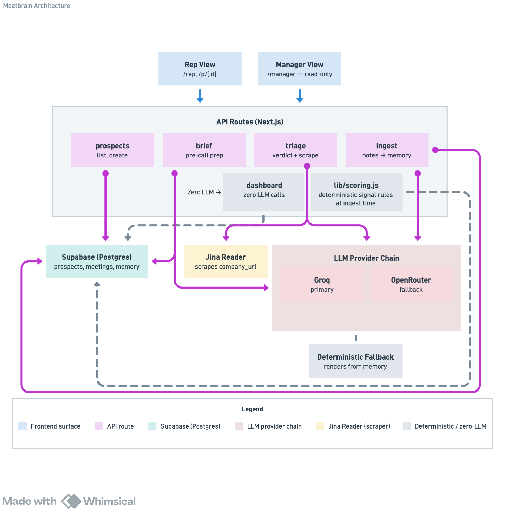

# Meetbrain

<div align="center">

[](https://nextjs.org/)
[](https://supabase.com/)
[](https://groq.com/)
[](https://openrouter.ai/)
[](https://jina.ai/reader/)
[](https://vercel.com/)

</div>

Meeting intelligence for sales teams: prep in 5 minutes, capture in 30 seconds, and every meeting makes the next one smarter.
Two surfaces, one shared brain:

- **Rep view** (`/rep`) - pick a prospect, get a brief tailored to the meeting type and everything past calls taught us, see a triage verdict on whether the meeting should happen at all, paste notes after.
- **Manager view** (`/manager`) - pipeline health scored from what actually happened in meetings: advancing vs stalling deals, meetings that should not have been booked, per-rep coaching signals.

## Architecture


- **Rep view / Manager view** - the two frontends; same backend, same database.
- **prospects** - creates and lists prospects (this is the entry point for adding a brand-new company by URL).
- **brief** - reads `memory` + meeting history, generates meeting-type-specific prep via the LLM chain.
- **triage** - scrapes `company_url` live via Jina Reader, runs a proceed/caution/dont_book verdict through the LLM, caches it until new notes invalidate it.
- **ingest** - takes pasted call notes, extracts structured facts via the LLM, merges into `memory` (newer facts win, open objections never silently dropped), recomputes the deal signal.
- **dashboard** - pure read of what `ingest` already computed - no LLM calls, so it never flakes.
- **lib/scoring.js** - deterministic rules (recency, booked next steps, open objections) that turn meeting history into `advancing` / `stalling` / `at_risk`.
- **Supabase** - the shared brain: `memory` (merged, durable facts) plus raw `meetings.notes` for audit.
- **Jina Reader** - free, keyless scraper, called only by triage, fails quietly after 8s.
- **Groq → OpenRouter** - the only LLM calls in the system, used by brief/triage/ingest; if both fail, briefs and triage render deterministically from `memory` instead of breaking.

### Run locally (optional)
```bash
cp .env.example .env.local   # fill in the same 4 values
npm install
npm run dev                  # http://localhost:3000
```

## Steps to Deploy (~ 15 minutes, $0)

### 1. Database (Supabase)
1. In your Supabase project, open **SQL Editor -> New query**.
2. Paste the entire contents of `supabase/schema.sql` and click **Run**.
3. That creates 3 tables and seeds 3 prospects with 6 meetings of history.

### 2. Push the code to GitHub
```bash
cd meetbrain
git init && git add -A && git commit -m "Meetbrain v1"
# create an empty repo on github.com named meetbrain, then:
git remote add origin https://github.com/YOUR_USERNAME/meetbrain.git
git branch -M main
git push -u origin main
```

### 3. Deploy on Vercel
1. vercel.com -> **Add New -> Project** -> import the `meetbrain` repo.
2. Framework preset: Next.js (auto-detected). Leave build settings untouched.
3. Before clicking Deploy, expand **Environment Variables** and add:

| Name | Value |
|---|---|
| `SUPABASE_URL` | your project URL, e.g. `https://xxxx.supabase.co` |
| `SUPABASE_SERVICE_KEY` | the `service_role` secret from Supabase -> Settings -> API |
| `GROQ_API_KEY` | from console.groq.com |
| `OPENROUTER_API_KEY` | from openrouter.ai (optional but recommended fallback) |

Or you can copy paste your .env.local file directly there to pull the variables.

4. Click **Deploy**. Your public URL is live in ~2 minutes; both views work immediately with seeded data.


## Tool inventory & free-tier limits (what breaks first)

| Tool | Free tier | What breaks first at scale |
|---|---|---|
| Vercel (Hobby) | 100 GB-hrs functions, 60s max duration | Function invocations are effectively unlimited for this workload; 60s cap could clip a slow LLM call - our 25s per-provider timeout stays well inside it. |
| Supabase (Free) | 500 MB database, pauses after 7 days inactivity | **This breaks first in a demo setting**: the project pauses after a week idle - open the dashboard to wake it. At real scale, row counts are trivial (text only); 500 MB fits years of notes. |
| Groq | ~14,400 requests/day, 6,000 tokens/min on llama-3.3-70b | **This breaks first in real usage.** A 10-rep team doing 12 meetings/wk each = ~360 LLM calls/wk - fine on requests, but token/min bursts at 9am Monday can 429. That is exactly why the chain falls to OpenRouter. |
| OpenRouter (`:free` models) | ~50 req/day without credits | Fallback only. If both throttle, the app renders briefs deterministically from memory - degraded but never down. |
| Jina Reader (r.jina.ai) | Keyless, rate-limited by IP (~20 rpm) | Only called on triage for prospects with a URL, and cached until new notes arrive. A dead or slow site fails silently after 8s and never blocks a brief. |

## Degradation ladder (designed, not accidental)

1. Groq up -> full AI briefs/triage/ingest.
2. Groq 429s -> OpenRouter, same prompts, same schemas.
3. Both down -> briefs and triage render deterministically from stored memory, clearly labeled; pasted notes are saved raw and merged automatically on the next successful ingest. The manager dashboard never calls an LLM at read time, so it is unaffected by any of this.

## Repo map

```
app/                  UI + API (Next.js App Router)
  page.js             rep home: pipeline list + add prospect
  p/[id]/page.js      deal workspace: brief -> triage -> notes -> history
  manager/page.js     manager dashboard
  api/                brief | triage | ingest | dashboard | prospects
lib/                  llm chain, prompts, scoring rules, fallbacks
supabase/schema.sql   tables + seed (paste into SQL Editor)
ONEPAGER.md           tradeoffs, production metrics, week-2 plan
```

## Beyond sales
 
Meetbrain is built for enterprise sales teams here, but nothing in the core loop - brief before, triage in between, memory after - is specific to selling. The same shape fits any recurring, high-stakes conversation where context needs to survive from one meeting to the next: customer discovery interviews, account management and renewals, recruiting pipelines, consulting engagements, even investor or partnership conversations. Swap "prospect" for "candidate" or "interviewee," and the same brief/triage/ingest loop holds.
 
If this is a shape you'd want for a different use case, I'd genuinely enjoy exploring it - feel free to reach out.
 
If this is useful to you, a star helps others find it - and pull requests are always welcome.